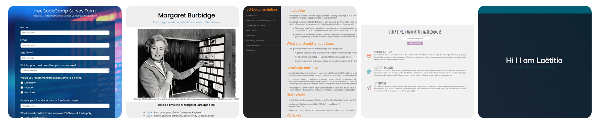
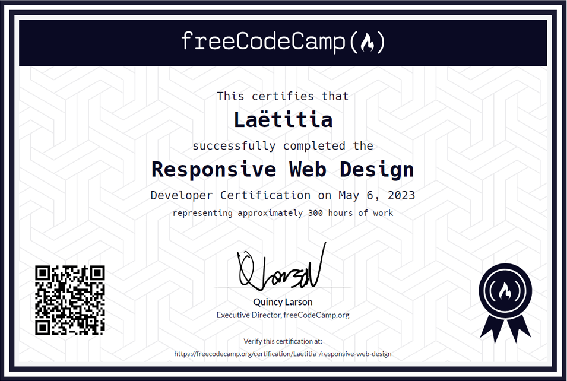

# Responsive Web Design Projects
This repository showcases my collection of 5 webpages created for the [freeCodeCamp](https://www.freecodecamp.org/learn/2022/responsive-web-design/) Responsive Web Design Certification

## Projects

▪ Survey Form : [CodePen](https://codepen.io/M-Laetitia/pen/gOZgXeZ)  
▪ Tribute Page : [CodePen](https://codepen.io/M-Laetitia/pen/WNLRXVQ)  
▪ Technical Documentation Page : [CodePen](https://codepen.io/M-Laetitia/pen/wvRgyve)  
▪ Product Landing Page : [CodePen](https://codepen.io/M-Laetitia/pen/poqRaRO)  
▪ Personal Portfolio : [CodePen](https://codepen.io/M-Laetitia/pen/WNLRMdy)

## Certificate

